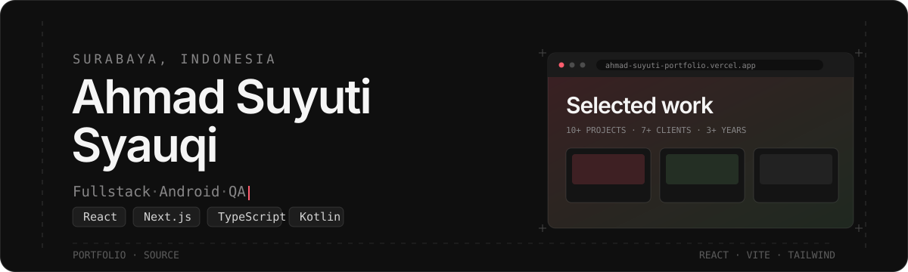
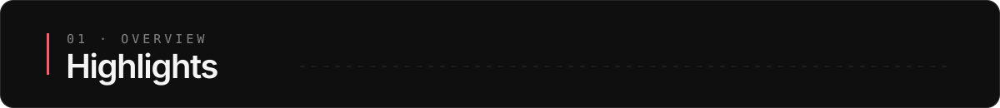
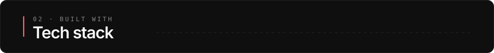
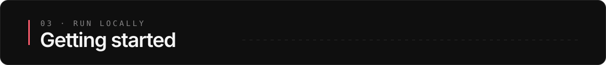
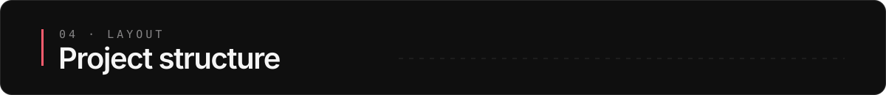

<p align="center">
  
</p>

<p align="center">
  <a href="https://ahmad-suyuti-portfolio.vercel.app/"><strong>Live site</strong></a>
  ·
  <a href="#getting-started">Run locally</a>
  ·
  <a href="#tech-stack">Tech stack</a>
</p>

<p align="center">
  
  
  
  
  
</p>

---

The source for my personal developer portfolio — a single-page site presenting who I am, what I build, and selected work. It's a precision-instrument surface: near-neutral fields, one coral accent, borders instead of shadows, and two motion durations for the whole product.



- **Light & dark themes** — token-driven (`oklch` CSS variables), resolved before first paint so the page never flashes. Follows the OS by default and remembers your choice.
- **Continuous work marquee** — two counter-scrolling strips of projects that pause on hover so any card stays clickable.
- **Accessible motion** — every animation honors `prefers-reduced-motion`; the typing headline falls back to static text.
- **Fast & SEO-ready** — WebP assets, lazy loading, Open Graph + Twitter cards, JSON-LD `Person` data, `robots.txt`, and a sitemap.
- **Resilient** — an error boundary keeps a single failing component from blanking the page; the contact form is spam-guarded with a honeypot.



| Layer | Choice |
|---|---|
| Framework | React 18 + TypeScript |
| Build | Vite 5 |
| Styling | Tailwind CSS 3, `oklch` design tokens |
| Fonts | Geist / Geist Mono (self-hosted, SIL OFL 1.1) |
| Icons | lucide-react |
| Contact | Web3Forms |
| Hosting | Vercel |



```bash
# clone and install
git clone https://github.com/Asyqii/my-portfolio.git
cd my-portfolio
npm install

# start the dev server
npm run dev
```

Then open the URL Vite prints (default `http://localhost:5173`).

### Other scripts

```bash
npm run build     # type-check, then build to dist/
npm run preview   # serve the production build locally
npm run lint      # run ESLint
```



```text
src/
├─ App.tsx                    # page composition + contact form
├─ components/
│  ├─ Navbar.tsx              # fixed header, theme toggle, mobile menu
│  ├─ TypingAnimation.tsx     # rotating role headline
│  ├─ Reveal.tsx              # scroll-in reveal (IntersectionObserver)
│  ├─ ErrorBoundary.tsx       # full-page fallback
│  ├─ layout/PortfolioSection.tsx  # scrolling work strips
│  └─ ui/                     # Frame, button classes
├─ hooks/useTheme.ts          # light/dark state + persistence
└─ index.css                  # design tokens, marquee, reveal, rails
```

## Customizing content

Most content lives in plain arrays at the top of the files, so no component surgery is needed:

- **Projects** — edit `ROW_ONE` / `ROW_TWO` in [`src/components/layout/PortfolioSection.tsx`](src/components/layout/PortfolioSection.tsx).
- **Services, skills, socials, stats** — edit the constants at the top of [`src/App.tsx`](src/App.tsx).
- **Contact form** — swap the Web3Forms `access_key` in [`src/App.tsx`](src/App.tsx) for your own.

## License

Released under the MIT License. The Geist fonts are licensed separately under the SIL Open Font License 1.1.
